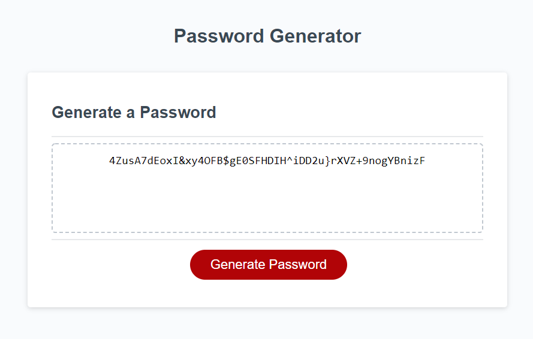

# 128-Character-Password-Generator

A Password Generator that can generate from 8 up to 128 character from lowercase, uppercase, and/or special characters

## Preview

## Where to access

Generate your randomize password today over here: [Randomize Password Generator](https://mbpjason.github.io/128-Character-Password-Generator/)

## How to use

Honestly just hit the red button that says "Generate Password". Depending on your first choice for number of characters, it will generate a password based on the four criteria you select for it. If the first choice isn't given a correct value no password will generate and it will prompt you again. If a correct value is given it will run down the the confirms to select with characters you would like to use for your password.

## Clean Code

Readability and future understanding was the highest priority in making the code run and look elegant. Prettier was used to format the code and comments were added to fully explain parts of the code anyone to understand.

## How it works

Magic.... but seriously it setups variables, used in if conditionals, to be called in a for loop that will attach a string together based on the users choices and display it in the text box as seen in the preview. This will give the user an easy copyable text to take and use for their next password choice.